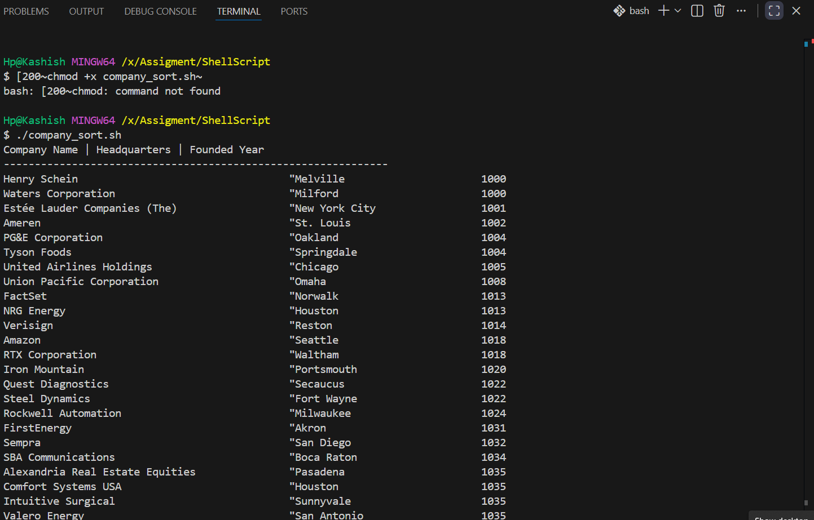

# Shell Script - S&P 500 Companies CSV Processor

A Bash shell script that downloads the S&P 500 companies dataset from GitHub, extracts **Company Name**, **Headquarters Location**, and **Founded Year**, sorts the companies by founded year, and displays the results in a clean tabular format.

---

## Features

- Downloads the CSV automatically using `curl`
- Extracts required columns
- Parses the first valid 4-digit founded year
- Sorts companies by founded year
- Displays formatted terminal output
- Uses standard Unix tools (`curl`, `awk`, `sort`)

---

## Technologies Used

- Bash
- curl
- awk
- sort

---

## Project Structure

```text
ShellScript/
├── company_sort.sh
├── README.md
└── screenshots/
    └── shell-script-output.png
```

---

## How to Run

```bash
chmod +x company_sort.sh
./company_sort.sh
```

Or on Windows using Git Bash:

```bash
./company_sort.sh
```

---

## Output

The script prints:

- Company Name
- Headquarters
- Founded Year

sorted by Founded Year.

---

## Screenshot



---

## Data Source

https://raw.githubusercontent.com/datasets/s-and-p-500-companies/refs/heads/main/data/constituents.csv

---

## Author

**Saniya Hakim**
