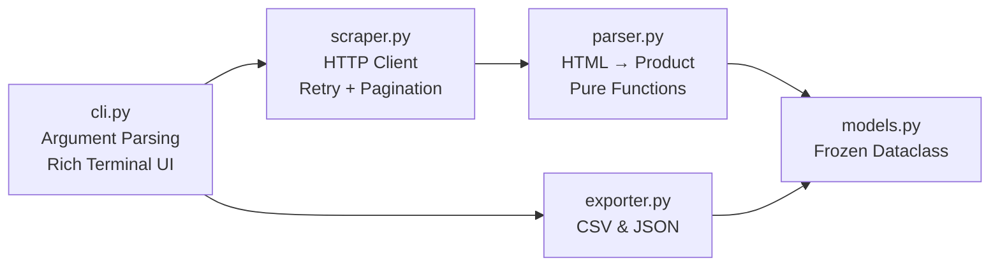

# MDComputers Product Scraper — Project Walkthrough

## What Was Built

A **production-grade Python web scraper** for [MDComputers.in](https://mdcomputers.in) with every professional feature requested.

## Architecture



## Pro Features Implemented

| Feature | Implementation |
|---|---|
| **Argument Parsing** | `argparse` with keyword, output path, format, max-pages, delay, timeout, retries, verbose flags |
| **Structured Logging** | Python `logging` + `rich.logging.RichHandler` — zero `print()` statements |
| **Unit Tests** | 15 tests covering parser, models, and exporters with inline HTML fixtures |
| **Auto-Pagination** | Detects total pages from results text or pagination links, fetches all |
| **Retry Logic** | `tenacity` exponential backoff (2s–30s) on `ConnectionError`, `Timeout`, `HTTPError` |
| **GitHub Actions CI** | Lint (ruff) + test (pytest) across Python 3.9–3.12 with pip caching and coverage enforcement |
| **Rich Terminal UI** | Colored tables, progress spinners, panels, styled output |
| **Modular Design** | Parsing is pure (no I/O) → trivially testable; scraper handles I/O separately |
| **Immutable Models** | `frozen=True` dataclass — hashable, safe for sets/dicts |
| **Session Pooling** | `requests.Session` for HTTP connection reuse |
| **Polite Crawling** | Configurable inter-request delay (default 1s) |
| **Dual Export** | CSV (with UTF-8 BOM for Excel) and JSON |

## Files Created

| File | Purpose |
|---|---|
| [scraper.py](file:///C:/Users/Hp/.gemini/antigravity-ide/scratch/mdcomputers-product-scraper/scraper.py) | Convenience entry point |
| [mdcomputers_scraper/\_\_init\_\_.py](file:///C:/Users/Hp/.gemini/antigravity-ide/scratch/mdcomputers-product-scraper/mdcomputers_scraper/__init__.py) | Package init |
| [mdcomputers_scraper/cli.py](file:///C:/Users/Hp/.gemini/antigravity-ide/scratch/mdcomputers-product-scraper/mdcomputers_scraper/cli.py) | CLI with rich output |
| [mdcomputers_scraper/scraper.py](file:///C:/Users/Hp/.gemini/antigravity-ide/scratch/mdcomputers-product-scraper/mdcomputers_scraper/scraper.py) | Core HTTP client |
| [mdcomputers_scraper/parser.py](file:///C:/Users/Hp/.gemini/antigravity-ide/scratch/mdcomputers-product-scraper/mdcomputers_scraper/parser.py) | HTML parser |
| [mdcomputers_scraper/models.py](file:///C:/Users/Hp/.gemini/antigravity-ide/scratch/mdcomputers-product-scraper/mdcomputers_scraper/models.py) | Product dataclass |
| [mdcomputers_scraper/exporter.py](file:///C:/Users/Hp/.gemini/antigravity-ide/scratch/mdcomputers-product-scraper/mdcomputers_scraper/exporter.py) | CSV/JSON export |
| [tests/test_parser.py](file:///C:/Users/Hp/.gemini/antigravity-ide/scratch/mdcomputers-product-scraper/tests/test_parser.py) | Parser + model tests |
| [tests/test_exporter.py](file:///C:/Users/Hp/.gemini/antigravity-ide/scratch/mdcomputers-product-scraper/tests/test_exporter.py) | Exporter tests |
| [.github/workflows/ci.yml](file:///C:/Users/Hp/.gemini/antigravity-ide/scratch/mdcomputers-product-scraper/.github/workflows/ci.yml) | GitHub Actions CI |
| [README.md](file:///C:/Users/Hp/.gemini/antigravity-ide/scratch/mdcomputers-product-scraper/README.md) | Full documentation |

## How to Run

```bash
cd C:\Users\Hp\.gemini\antigravity-ide\scratch\mdcomputers-product-scraper

# Install
pip install -r requirements.txt

# Basic usage
python scraper.py "external harddrive"

# Advanced
python scraper.py "rtx 4060" --format json -o gpu_results.json --max-pages 3 -v

# Run tests
pip install -r requirements-dev.txt
pytest -v
```
